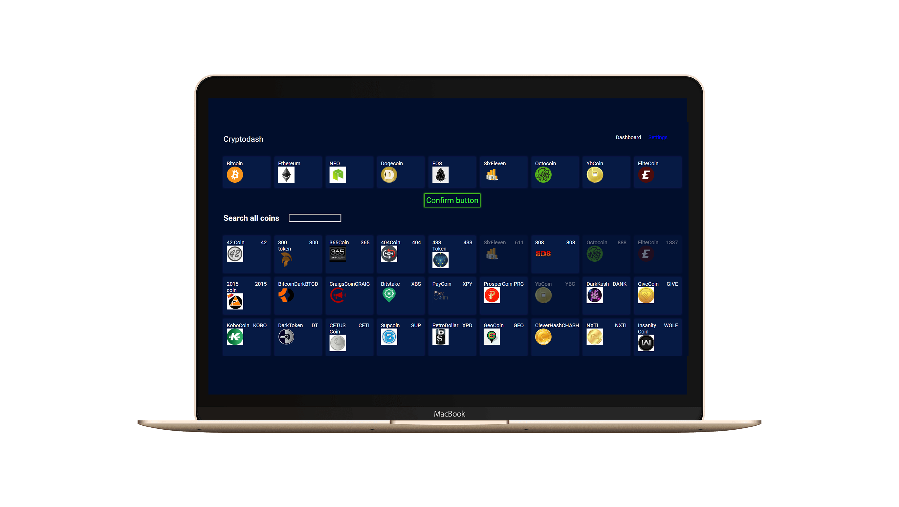

<h1 align="center">
    
</h1>

<h4 align="center">
   Cryptodash - An cryptocurrency for you!
</h4>

 

  

## 💻 Project

An crypocurency dashboard where you can select your favorites coins. On dashboard page you can view the balance daily, weekly and anualy of your favorites coins.

## :rocket: Techs

- [ReactJS]
- [Highcharts]
- [Moment]

---

☕ Glauber Brack - <a href="mailto:glauber@brack.com.br?Subject=Hello%20you">Mail me!</a>
